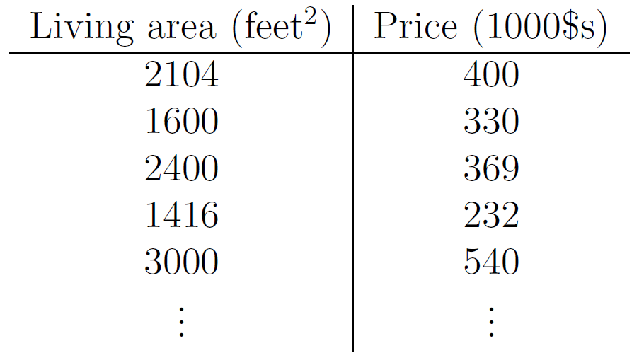

# Linear Regression and Gradient Descent

## Supervised Learning

Supervised Learning의 예시를 보며 먼저 이해를 해보자.

아래와 같이 size-price Dataset이 존재한다고 치자. 

그리고 이를 ploting해서 아래 사진처럼 나타냈다.

위처럼 Dataset이 주어졌을 때, 어떻게 해야 size에 따른 price를 예측하는 모델을 만들 수 있는 가?

그전에... 아래와 같이 notation들을 정리하고 간다.

---

**Notations**

$(i)$ : index. 오른쪽위에 나타나있는 거는 지수가 아니라 index를 의미함.

$x^{(i)}$ : input variable $\leftrightarrow$ input features

$y^{(i)}$ : output $\leftrightarrow$ target variable

$(x^{(i)}, \ y^{(i)})$ : training example

$\{(x^{(i)}, \ y^{(i)});i \ = 1, ...,n\}$ : training set

$\mathcal{X}$: space of input values

$\mathcal{Y}$: space of output values

---

Supervised Learning Problem은  $h : \mathcal{X} \rightarrow \mathcal{Y}$ 에서 input값에 대해서 output을 예측하는 "good" predictor $h(x)$를 만드는 것이다. 그리고 이는 **hypothesis(가설)**이라 불린다.

그림으로 나타내면 아래와 같다. 

이때, target variable이 continuous하면 **regression problem**이라 하고, 몇 가지의 정확한 값들만 가지는 경우에는 **classficiation problem**이라 한다.

---

## Part1. Linear Regression

위에서 소개한 문제에 대해서 input feature를 추가해보자. 아래와 같이 bedrooms의 개수도 인자값으로 추가되었다.

위와 같은 경우에는 input이 2차원으로 변하였다. 

이때, 다음과 같이 notation을 정의하자. *보통 더 일반적인 경우에는 아래보다 인자가 훨씬 많다.

$\mathcal{x}^{(i)}_1$ : living area of i-th house

$\mathcal{x}^{(i)}_2$ : number of bedrooms of i-th house

---

이제, Supervised Learning을 하기 위해서 $h$ 함수를 정의해줄 것이다. 시초값은 아래와 같이 $y$가 $x$에 대해서 linear function이라 하자.

$$h_\theta(x)=\theta_0\ + \theta_1x_1 \ + \theta_2x_2
\\
h(x)= \sum_{i=0}^{d}\theta_ix_i \ = \theta^Tx$$

- $\theta_i$ : **paramters**(또는 **weights**) $\leftrightarrow$  $\mathcal{X}$와 $\mathcal{Y}$를 공간으로 표현할 수 있게 연결해주는 매개변수 ( 혼동되지 않는 선에서 생략가능하다. )
- $x_0$은 1이라 가정하자.
- $\theta^Tx$에서 $\theta$와 $x$는 모두 vector이다.

---

이제 $\theta$값을 어떻게 선택할 것인가? 이때, 가장 일리있는 것은 hypothesis $h$가 $y$와 비슷하게 만들어주는 것이다. 그래서 $h$가 $y$와 비슷한 값을 가지도록 만들어 줄 것인데, 이때 계산을 위해 **cost function** 하자. 

**Cost function**은 $h_\theta(x^{(i)})$와 $(y^{(i)})$사이 거리가 얼마나 가까운지 값으로 나타내기 위한 것으로 아래와 같이 정의하였다.

$$J(\theta)\ =\ \frac{1}{2}\sum^n_{i=1}(h_\theta(x^{(i)})-(y^{(i)}))^2$$

**위 식은 **ordinary least squares**로도 알려져 있다.

이제 이 값을 최소화를 하게 만드는 hypothesis $h$를 구해보도록 하자.

---

### 1 LMS Algorithm

$\theta$를 적당히 잘 골라서 $J(\theta)$의 값을 최소화시켜보자.

이를 위해서 **gradient descent**라 불리는 알고리즘을 필요로 한다. 이는 특정 초기 $\theta$값으로 시작을 해서, 계속해서 $J(\theta)$의 값을 줄여나가는 방법이다. 이는 각 지점에서 가장 기울기가 낮은 방향으로 진행을 하는 것이다. 

아래 사진을 보면, 각 지점에서 위에서 봤을 때 가장 기울기가 낮은곳으로 이동을 하여, 이 과정을 반복하면 local하게 가장 낮은 곳으로 도달 할 수 있다는 것이다.

하지만, 입력값에 따라 위처럼 다른 결론에 도달할 수 있다.

**gradient descent algorithm** 을 고려하면...

update : 

$$\theta_j := \theta_j -\alpha\frac{\partial}{\partial \theta_j}J(\theta)$$

- 위와 같이 update를 정의할 수 있다. 이는 주어진 $\theta$에서 다음 $\theta$로 이동하기 위한 식이다.
- $j$는 0,1,2,...n
- $\alpha$ 는 learning rate이다.

---

가장 심플한 경우를 생각해보자. training example로 $(x,y)$가 주어졌으면 아래와 같이 편미분을 처리할 수 있다.

$$\begin{aligned} \frac{\partial}{\partial\theta_j}J(\theta) \  &= \ \frac{\partial}{\partial\theta_j}\frac{1}{2}(h_\theta(x)-y)^2 \\ 
&= 2 * \frac{1}{2}(h_\theta(x)-y)\ * \ \frac{\partial}{\partial\theta_j}(h_\theta(x)-y) \\ 
&= (h_\theta(x)-y) * \frac{\partial}{\partial\theta_j} \left(\sum^d_{i=0}\theta_ix_i-y \right) \\ 
&= (h_\theta(x) - y) x_j \end{aligned}$$

즉, update rule이 아래와 같이 바뀐다.

$$\theta_j := \theta_j + \alpha(y^{(i)} - h_\theta(x^{(i)}))x_j^{(i)}$$

위 rule을 **LMS(least mean squares) update rule** (또는 **Widrow-Hoff**)이라 한다. 현재 위 식은 single training example에 대해서만 일반화한 것이다. 그래서 이를 여러개의 example에 대해서도 일반화를 하면 아래와 같이 2가지 방법으로 식을 정의할 수 있다.

(1)

$$\begin{aligned}&\text{Repeat until convergence} \ \{ \\

&\theta_j := \theta_j + \alpha\sum^n_{i=1}(y^{(i)} - h_\theta(x^{(i)}))x_j^{(i)},\ (\text{for every j}) \\
&\}\end{aligned}$$

첫번째 식은 위와 같이 나타낼 수 있다. 이를 모두 벡터로 다시 표현하면

$$\theta := \theta + \alpha\sum^n_{i=1}(y^{(i)} - h_\theta(x^{(i)}))x^{(i)}$$

위와 같이 표현 가능하다.

그러면 이제 위에서 summation하는 부분은 $\frac{\partial J(\theta)}{\partial\theta_j}$임을 알 수 있다. 즉, Cost function의 simply gradient descent이다. 이는 training set의 모든 example, 모든 step에 대해서 행해지고, 이를 보고 **batch gradient descent**라 한다. 

** 대부분의 optimization problem의 경우 보통 only one global optima를 갖는다. 즉, local하게 다른 optima가 생기는 경우는 고려하지 않아도 된다.

---

실제로 $J$는 볼록 2차함수이다. 그리고 아래 사진은 이 방법을 이용해서 2차함수의 최솟값을 구하는 과정을 나타낸 것이다.

그리고, 처음 주어졌던 주택 문제에 대해서 batch gradient descent 방법을 이용해 $\theta$를 구하게 되면 아래와 같이 $h_\theta(x)$를 구할 수 있게 된다.

---

(2) 

$$\begin{aligned} \text{Loop} \ &\{ \\ &\text{for i=1 to n, \{}\\
 & \ \ \ \ \ \theta_j :=  \theta_j + \alpha(y^{(i)} - h_\theta(x^{(i)}))x_j^{(i)},\ (\text{for every j})\\
&\} \\
\}\ \ \ \ \ \ \ &
\end{aligned}$$

두 번째 식은 위와 같이 나타낼 수 있다. 이를 모두 벡터로 나타내면

$$\theta := \theta + \alpha(y^{(i)} - h_\theta(x^{(i)}))x^{(i)}$$

핵심적인 부분이 위와 같이 변화한다.

위 알고리즘은 모든 traininng set과 그에 속하는 example들에 대해서 위 update를 적용하고 parameter를 변화시키게 된다. (1)과의 차별점으로는 (1)에서는 모든 feature에 대해서 한번에 처리를 하게 되고, (2)는 각각 따로 처리를 하게 된다. 그래서 각 example에 대해서 바로바로 run을 할 수 있다.

이런 방법을 보고, **stochastic gradient descent (또는 incremental gradient descent)** 라 한다

일반적으로 stochastic gradient descent가 batch gradient descent에 비해 훨씬 빠르게 minimum 값에 가까운 $\theta$를 찾아내게 된다. 하지만, 정확히 minimum한 $\theta$를 찾아내는 것은 아니라는 단점이 있다. (아래 사진 처럼 optima 주변에서 계속해서 진동을 하게될 것임.)

하지만, minimum에 가까운 $\theta$값은 보통은 거의 minimum에 가깝고, **의미 있는 데이터임과 동시에 훨씬 빠른 속도를 보여주기에 training set이 큰 경우에는 batch gradient descent보다 stochastic gradient descent가 선호된다.**

---

### 2 The normal equations

lms 알고리즘 말고 cost function $J$의 값을 최소화 하는 방법이 있다.

이는 derivatives(미분)을 이용하는 것이다.

**2.1. Matrix derivatives**

본격적으로 설명하기전, 행렬 미분에 대해 이야기 하고 넘어가도록 하자.

$f\ :\ \mathbb{R}^{n\times d}\ \rightarrow \mathbb{R}$ 는 n x d 실수 행렬이고, A에 대한 미분은 다음과 같이 나타낸다.

$$\triangledown_Af(A)=\begin{bmatrix}
\frac{\partial f}{\partial A_{11}} & ... & \frac{\partial f}{\partial A_{1d}} \\
\vdots & \ddots & \vdots \\ 
\frac{\partial f}{\partial A_{n1}} & ... & \frac{\partial f}{\partial A_{nd}}\end{bmatrix}$$

**2.2 Least squares revisited**

matrix derivatives를 이용해서 $J(\theta)$를 최소화시키는 $\theta$를 찾아보도록 하겠다. 

먼저, $**J(\theta)$를 matrix-vertorial notation형태**로 쓰는걸로 시작한다.

주어진 Training set에 대해서 **design matrix** $X$를 다음과 같이 정의하자. 

$$X\ = \begin{bmatrix} —(x^{(1)})^T— \\ —(x^{(2)})^T—  \\ \vdots \\ —(x^{(n)})^T— \end{bmatrix}$$

** $X$는 n-by-d matrix이고, 각각의 training examples의 input values를 row로 가지고 있다.

동시에, $\vec{y}$를 다음과 같이 정의한다. 

$$\vec{y} = 
\begin{bmatrix}
y^{(1)} \\
y^{(2)} \\
\vdots \\
y^{(n)} \\
\end{bmatrix}$$

**각각의 row는 target values로 이루어져 있다.

이때, $h_\theta(x^{(i)})=(x^{(i)})^T\theta$이기에 다음과 같이 계산할 수 있다.

$$\begin{aligned} X\theta \ - \vec{y} \ & = 
\begin{bmatrix} 
(x^{(1)})^T\theta \\
\vdots \\
(x^{(n)})^T\theta 
\end{bmatrix} -
\begin{bmatrix} 
y^{(1)}\\
\vdots \\
y^{(n)}\\
\end{bmatrix} 
\\
& = 
\begin{bmatrix}
h_\theta(x^{(1)})-y^{(1)} \\
\vdots \\
h_\theta(x^{(n)})-y^{(n)}

\end{bmatrix}

\end{aligned}$$

이때, 주어진 vector $z$에 대해서 $z^Tz \ = \ \sum_iz^2_i$ 라는 사실을 이용하면,

$$\begin{aligned} \frac{1}{2}(X\theta - \vec{y})^T (X\theta-\vec{y}) & = \frac{1}{2} \sum^n_{i=1}(h_\theta(x^{(i)})-y^{(i)}) ^ 2 \\ & =  J(\theta) \end{aligned}$$

위와 같이 $J(\theta)$를 표현할 수 있게 된다.

그래서, 이제 $J$의 값을 최소화 시키기 위해서, $\theta$에 대한 미분값을 구해보자.

$\begin{aligned} 
\triangledown_\theta J(\theta) 
&= \triangledown_\theta \frac{1}{2}(X\theta-\vec{y})^T(X\theta-\vec{y}) \\
&= \frac{1}{2}\triangledown_\theta ((X\theta)^TX\theta-(X\theta)^T\vec{y}-\vec{y}^T(X\theta) +\vec{y}^T\vec{y}) \\
&=\frac{1}{2}\triangledown_\theta (\theta^T(X^TX)\theta - \vec{y}^T(X\theta) - \vec{y}(X\theta)) \\
&=\frac{1}{2}\triangledown_\theta (\theta^T(X^TX)\theta - 2(X^T\vec{y})^T\theta) \\
&=\frac{1}{2}(2X^TX\theta-2X^T\vec{y}) \\
&= X^TX\theta - X^T\vec{y}
\end{aligned}$

**세번째 줄에서 $a^Tb = b^Ta$란 사실을 이용했음.

***5번째 줄에서 $\triangledown_xb^Tx =b$ , $\triangledown_xx^TAx=2Ax$ for symmetric matrix $A$란 사실을 이용함

그래서 $J$를 최소화 시키려면 미분값이 0인 부분을 찾아야 한다. 이때, 이를 만족하게 해주는 식인 다음 식을 **normal equations** 라 한다.

$$X^TX\theta=X^T\vec{y}$$

그래서, 이를 정리하면, $J(\theta)$를 최소로 하는 $\theta$는 다음과 같다.

$$\theta = (X^TX)^{-1}X^T\vec{y}^3$$